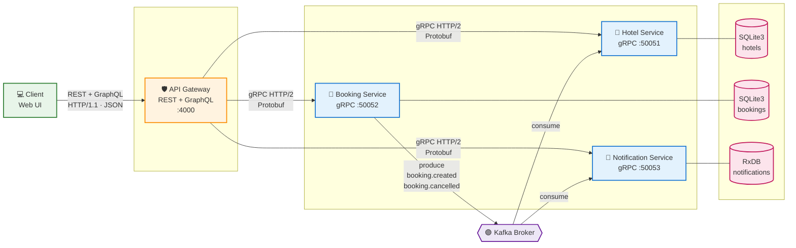
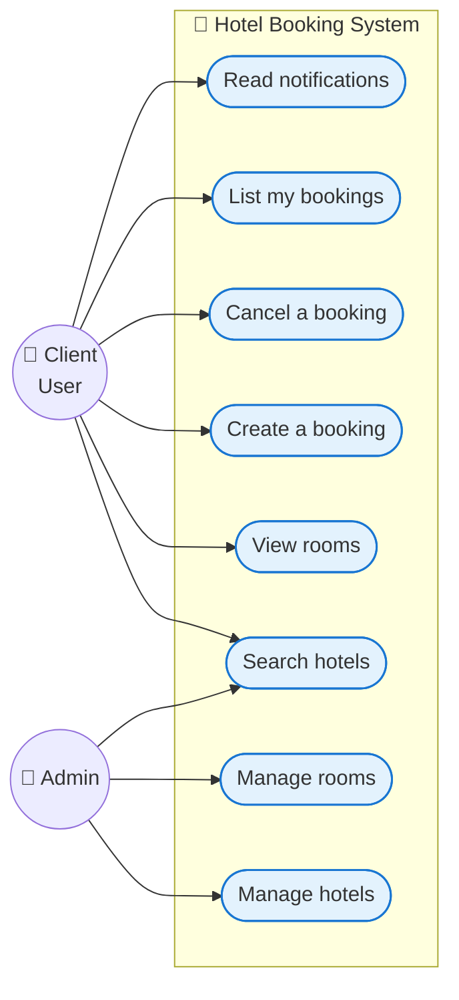
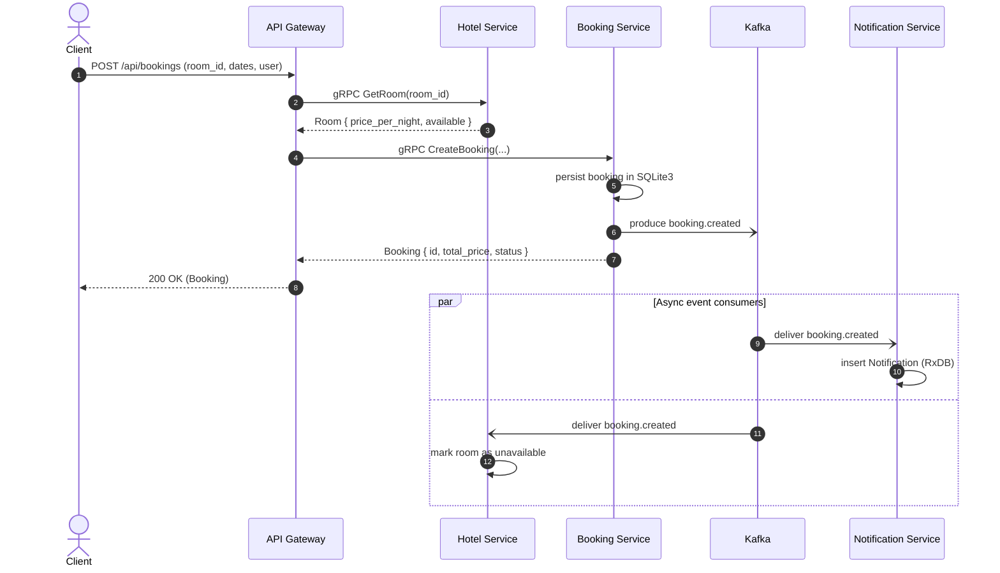
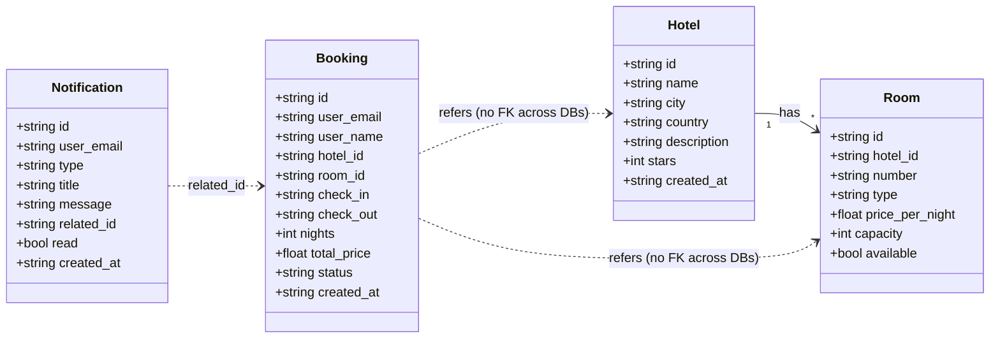

# 🏨 Hotel Booking — Microservices Project

**SoA & Microservices · 2025/2026**
**Authors:** Assil Hedfi · Meriam Gahbiche
**Repository:** <https://github.com/assilhedfi21/booking-hotel>

A hotel-booking application built **entirely in Node.js** following a microservices
architecture: **REST + GraphQL** at the edge, **gRPC** between services, **Kafka**
for asynchronous events and **SQLite3 + RxDB** for per-service storage.

---

## 📑 Table of contents

- [1. Architecture](#1-architecture)
- [2. Technology stack](#2-technology-stack)
- [3. Project structure](#3-project-structure)
- [4. Use case (UML)](#4-use-case-uml)
- [5. Sequence diagram (booking flow)](#5-sequence-diagram-booking-flow)
- [6. Class / Domain diagram](#6-class--domain-diagram)
- [7. gRPC contracts (.proto)](#7-grpc-contracts-proto)
- [8. REST endpoints](#8-rest-endpoints)
- [9. GraphQL schema](#9-graphql-schema)
- [10. Kafka topics](#10-kafka-topics)
- [11. Databases](#11-databases)
- [12. Installation and run](#12-installation-and-run)
- [13. Demo scenario](#13-demo-scenario)
- [14. Postman collection](#14-postman-collection)
- [15. Team & contribution](#15-team--contribution)

---

## 1. Architecture

The architecture matches the one required by the project spec: a client talks REST and GraphQL to the API Gateway, which fans out to three microservices over gRPC, and the services exchange business events through Kafka.



**Components**

| # | Component | Role |
|---|-----------|------|
| 1 | **Client (Web UI)** | Static SPA-style page served by the API Gateway. Talks REST + GraphQL only. |
| 2 | **API Gateway** | Single entry point. Exposes REST and GraphQL. Calls services via gRPC. Holds **no business logic**. |
| 3 | **Hotel Service** | Manages hotels and rooms. SQLite3. Consumes Kafka events to update room availability. |
| 4 | **Booking Service** | Manages reservations. SQLite3. Publishes `booking.created` / `booking.cancelled` Kafka events. |
| 5 | **Notification Service** | Stores user notifications in RxDB. Consumes Kafka events to generate them. |
| 6 | **Kafka Broker** | Async event bus, KRaft mode (no Zookeeper). |

---

## 2. Technology stack

- **Runtime:** Node.js ≥ 22.5 (uses built-in `node:sqlite`)
- **gRPC:** `@grpc/grpc-js` + `@grpc/proto-loader` (HTTP/2 + Protobuf)
- **REST:** Express
- **GraphQL:** Apollo Server v4 + `graphql-tag`
- **Kafka:** KafkaJS + Bitnami Kafka 3.7 (KRaft) via Docker Compose
- **Databases:**
  - SQLite3 (`node:sqlite`) for `hotel-service` and `booking-service`
  - RxDB (in-memory + JSON dump) for `notification-service`
- **Container:** Docker Compose (Kafka + Kafka UI)

---

## 3. Project structure

```
booking-hotel/
├── api-gateway/                # REST + GraphQL gateway, gRPC clients
│   └── src/
│       ├── graphql/            # schema.js + resolvers.js
│       ├── grpc/clients.js     # promisified gRPC stubs
│       ├── rest/*.routes.js    # hotels / bookings / notifications
│       └── index.js            # Express + Apollo bootstrap
│
├── services/
│   ├── hotel-service/          # gRPC server + SQLite3 + Kafka consumer
│   ├── booking-service/        # gRPC server + SQLite3 + Kafka producer
│   └── notification-service/   # gRPC server + RxDB + Kafka consumer
│
├── client/                     # static demo web client (served by gateway)
│   └── public/                 # index.html · styles.css · app.js
│
├── proto/                      # gRPC contracts (.proto)
│   ├── hotel.proto
│   ├── booking.proto
│   └── notification.proto
│
├── docker/
│   └── docker-compose.yml      # Kafka-only stack (alternative)
├── docker-compose.yml          # full stack (gateway + 3 services + Kafka)
├── api-gateway/Dockerfile
├── services/*/Dockerfile
│
├── postman/                    # Postman collection + environment
├── docs/                       # extra documentation
└── package.json                # npm workspaces root
```

---

## 4. Use case (UML)



---

## 5. Sequence diagram (booking flow)

End-to-end scenario when a user books a room.



---

## 6. Class / Domain diagram



> Each microservice keeps its own database; cross-service IDs are referenced by value (no joins across DBs), as expected in microservice architectures.

---

## 7. gRPC contracts (.proto)

The full contracts are in [`proto/`](./proto). High-level summary:

### `hotel.proto` — `HotelService` (port `50051`)

| RPC | Description |
|-----|-------------|
| `CreateHotel` / `GetHotel` / `ListHotels` / `UpdateHotel` / `DeleteHotel` | Hotel CRUD |
| `SearchHotels(city, min_stars)` | Filter hotels |
| `AddRoom` / `ListRooms` / `GetRoom` / `SetRoomAvailability` | Rooms management |

### `booking.proto` — `BookingService` (port `50052`)

| RPC | Description |
|-----|-------------|
| `CreateBooking` | Creates a booking and triggers `booking.created` Kafka event |
| `GetBooking` / `ListBookings` / `ListBookingsByUser` | Read access |
| `CancelBooking` | Cancels a booking and triggers `booking.cancelled` |

### `notification.proto` — `NotificationService` (port `50053`)

| RPC | Description |
|-----|-------------|
| `ListNotifications` / `GetNotificationsByUser` | Read notifications |
| `MarkAsRead` | Mark a notification as read |

The gateway loads these `.proto` files at startup with `keepCase: true` so field names stay snake_case across the wire.

---

## 8. REST endpoints

Base URL: `http://localhost:4000/api`

### Hotels

| Method | Path | Description |
|--------|------|-------------|
| `GET` | `/hotels` | List hotels (`?city=&min_stars=` for search, `?limit=&offset=` for pagination) |
| `POST` | `/hotels` | Create a hotel |
| `GET` | `/hotels/:id` | Get one hotel |
| `PUT` | `/hotels/:id` | Update a hotel |
| `DELETE` | `/hotels/:id` | Delete a hotel |
| `GET` | `/hotels/:id/rooms` | List rooms of a hotel |
| `POST` | `/hotels/:id/rooms` | Add a room to a hotel |

### Bookings

| Method | Path | Description |
|--------|------|-------------|
| `GET` | `/bookings` | List bookings (or `?user_email=` to filter) |
| `POST` | `/bookings` | Create a booking |
| `GET` | `/bookings/:id` | Get one booking |
| `POST` | `/bookings/:id/cancel` | Cancel a booking |

### Notifications

| Method | Path | Description |
|--------|------|-------------|
| `GET` | `/notifications` | List all notifications (`?user_email=` to filter) |
| `POST` | `/notifications/:id/read` | Mark a notification as read |

### Health

| Method | Path | Description |
|--------|------|-------------|
| `GET` | `/health` | Gateway health check |

---

## 9. GraphQL schema

GraphQL endpoint: `http://localhost:4000/graphql`

Queries and mutations cover the same surface as REST but allow flexible field selection and **cross-service joins** (a `Booking` can resolve its `Hotel` and `Room` through gRPC).

```graphql
type Query {
  hotels(limit: Int, offset: Int): [Hotel!]!
  hotel(id: ID!): Hotel
  searchHotels(city: String, minStars: Int): [Hotel!]!
  rooms(hotelId: ID!): [Room!]!

  bookings(limit: Int, offset: Int): [Booking!]!
  booking(id: ID!): Booking
  bookingsByUser(userEmail: String!): [Booking!]!

  notifications(limit: Int): [Notification!]!
  notificationsByUser(userEmail: String!): [Notification!]!
}

type Mutation {
  createHotel(input: CreateHotelInput!): Hotel!
  deleteHotel(id: ID!): DeleteResponse!
  addRoom(input: AddRoomInput!): Room!

  createBooking(input: CreateBookingInput!): Booking!
  cancelBooking(id: ID!): Booking!

  markNotificationAsRead(id: ID!): Notification!
}
```

**Why GraphQL here?** It demonstrates how a single query can pull a booking
alongside its hotel name, room number and price, even though those fields live
in **two separate microservices** and **two separate databases**. The gateway
resolves the joins transparently via gRPC.

Example query:

```graphql
{
  bookings {
    id
    status
    total_price
    hotel { name city stars }
    room  { number type }
  }
}
```

---

## 10. Kafka topics

Kafka is used for **business events** that other services react to. It is not used artificially.

| Topic | Producer | Consumers | Payload (JSON) | Trigger |
|-------|----------|-----------|----------------|---------|
| `booking.created` | `booking-service` | `notification-service`, `hotel-service` | `Booking` | A user successfully creates a booking |
| `booking.cancelled` | `booking-service` | `notification-service`, `hotel-service` | `Booking` | A user cancels a booking |

**Why these events?**

- `notification-service` listens to both topics to **create a notification** for the user.
- `hotel-service` listens to both topics to **update room availability** without coupling itself to the booking service via gRPC.

Without Kafka, services would have to call each other synchronously for every state change, which would defeat the purpose of microservice decoupling.

---

## 11. Databases

Each microservice owns its database — no shared schema, no cross-DB joins.

| Service | Engine | Why |
|---------|--------|-----|
| `hotel-service` | **SQLite3** (`node:sqlite`) | Structured, relational data (hotels ↔ rooms) |
| `booking-service` | **SQLite3** (`node:sqlite`) | Transactional reservations |
| `notification-service` | **RxDB** (NoSQL) | Document-oriented notifications, naturally reactive |

Hotel-service ships with **seed data** (3 hotels, 5 rooms) so the demo is usable immediately.

---

## 12. Installation and run

You have two ways to run the project: **Docker (recommended)** or **Node.js locally**.

### Option A — Docker Compose (recommended)

Builds and starts everything: Kafka broker, the 3 microservices, the API Gateway and Kafka UI.

```bash
docker compose up --build
```

Once the logs settle, open:

| URL | What |
|-----|------|
| <http://localhost:4000> | Web client (served by the gateway) |
| <http://localhost:4000/graphql> | Apollo GraphQL studio |
| <http://localhost:4000/api/health> | Gateway health check |
| <http://localhost:8080> | Kafka UI |

To stop everything:

```bash
docker compose down
```

To wipe persistent volumes (databases, kafka logs):

```bash
docker compose down -v
```

### Option B — Run with Node.js

#### Prerequisites

- **Node.js ≥ 22.5** (required for built-in `node:sqlite`)
- **Docker** (only for Kafka — or skip it; services degrade gracefully)

#### 1) Install dependencies

```bash
npm install
```

This uses npm workspaces and installs everything in one go.

#### 2) Start Kafka (optional but recommended)

```bash
npm run kafka:up
# Kafka UI -> http://localhost:8080
```

#### 3) Start the microservices (in 4 separate terminals)

```bash
npm run start:hotel          # gRPC :50051
npm run start:booking        # gRPC :50052
npm run start:notification   # gRPC :50053
npm run start:gateway        # http :4000
```

#### 4) Open the app

```
http://localhost:4000
```

The gateway serves the demo client, REST API and GraphQL endpoint together.

### Stop everything

```bash
# Ctrl+C in each terminal
npm run kafka:down
```

### Postman

A complete Postman collection is available in [`postman/`](./postman). Import both
`Hotel-Booking-Microservices.postman_collection.json` and
`Hotel-Booking.postman_environment.json`, select the **Hotel Booking - Local**
environment, and you can exercise every REST endpoint and GraphQL operation
without writing a single curl command.

---

## 13. Demo scenario

1. Open <http://localhost:4000>
2. **Hotels tab** — see the seeded hotels and rooms.
3. Click **Book** on an available room, fill the form, submit.
   - Gateway reads the room price via gRPC from `hotel-service`.
   - Gateway calls `CreateBooking` via gRPC on `booking-service`.
   - `booking-service` publishes `booking.created` on Kafka.
   - `notification-service` consumes the event → stores a notification in RxDB.
   - `hotel-service` consumes the event → marks the room as unavailable.
4. **My bookings tab** — load by email, see your confirmed booking. Cancel it → the chain replays in reverse.
5. **Notifications tab** — load by email and see the auto-generated notifications.
6. **GraphQL playground tab** — run cross-service queries like:

   ```graphql
   { bookingsByUser(userEmail: "you@x.com") { id status hotel { name } room { number } } }
   ```

---

## 14. Postman collection

A ready-to-import Postman collection covering every REST and GraphQL endpoint lives in [`postman/`](./postman):

- `Hotel-Booking-Microservices.postman_collection.json`
- `Hotel-Booking.postman_environment.json`

**How to use:**

1. Open Postman → **Import** → select both JSON files.
2. Pick the **Hotel Booking - Local** environment in the top-right.
3. Make sure the stack is running (`docker compose up --build`).
4. Run the requests from top to bottom — `bookingId` and `notificationId` are
   automatically captured between requests by test scripts so you do not need
   to copy-paste IDs.

The collection is organised in 5 folders: **Health**, **Hotels (REST)**,
**Bookings (REST)**, **Notifications (REST)** and **GraphQL** (queries +
mutations).

---

## 15. Team & contribution

| Member | Email | GitHub | Focus |
|--------|-------|--------|-------|
| **Assil Hedfi** | <assil.hedfi@polytechnicien.tn> | [@assilhedfi21](https://github.com/assilhedfi21) | gRPC, API Gateway, Kafka producer, Web UI logic |
| **Meriam Gahbiche** | <Meriam.gahbiche@polytechnicien.tn> | [@gahbichemeriam](https://github.com/gahbichemeriam) | Proto contracts, REST routes, RxDB layer, Web UI, Documentation |

### Workflow

- Branch model: `main` ← `develop` ← `feature/*` / `fix/*`
- Each feature is developed on its own branch and merged into `develop` with a non-fast-forward merge so the history stays readable.
- Commits follow [Conventional Commits](https://www.conventionalcommits.org/) (`feat`, `fix`, `chore`, `docs`, …).
- Contribution is balanced 50 / 50 — see `git shortlog -sn` to verify.

```bash
# verify contribution split
git shortlog -sn --no-merges
```

---

**License:** MIT
